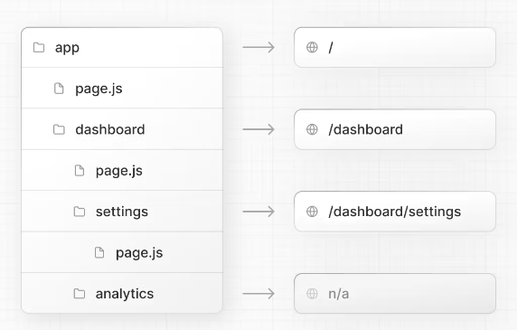
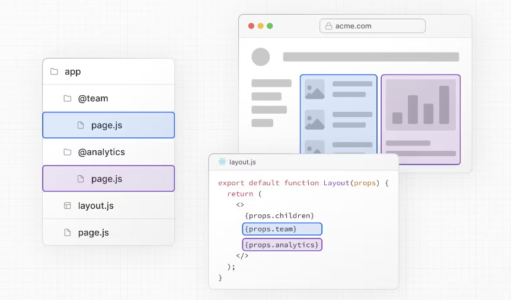
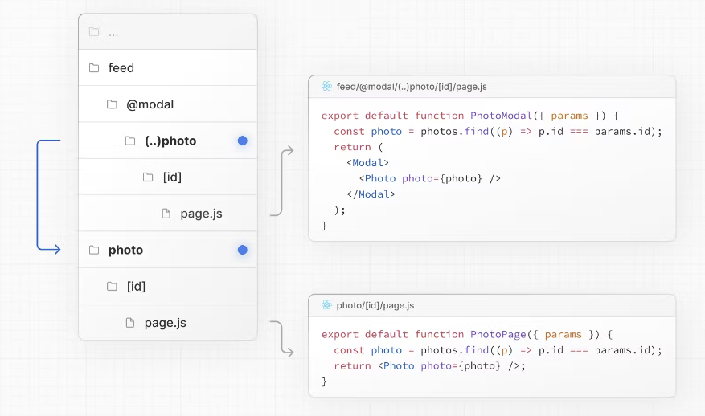
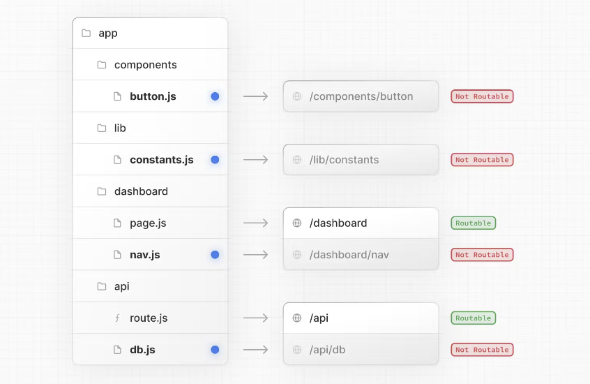
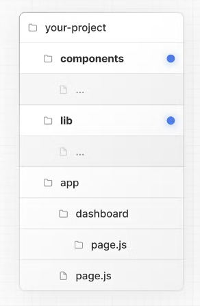
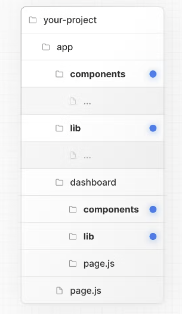

# Routing Fundamentals

- v13부터 App Router로 이루어진다.
- 레이아웃, 로딩, 에러 등이 제공되어진다.
- 기존의 Page Router도 사용가능하다.

## App Router

- 폴더는 path를 나타낸다.
- 마지막 폴더에는 반드시 page.js 파일이 필요하다.

## File Conventions

- page.js
- layout.js
- loading.js
- error.js
- global-error.js
- not-found.js

# Defining Routes

- 경로 생성 후 page 파일에 UI를 작성한다.
<div>
  
</div>

# Pages & Layout

## Pages

- 고유한 UI이다.
- page.js로 구성요소를 내보내어 페이지 정의할 수 있다.

## Layout

- 공유하는 UI이다.
- re-render되지 않는다
- Metadata를 활용하여 <head>의 데이터를 바꿀 수 있다.

# Linking and Navigating

- server-centric routing과 client-side navigation을 같이 사용한다.
- <Link> Component
- useRouter() Hook

## Link

```
import Link from 'next/link';

export default function Page() {
  return <Link href="/dashboard">Dashboard</Link>;
}
```

### Props

- href
  - 변수 보내는 작업 가능
  ```
  <Link
  href={{
    pathname: '/about',
    query: { name: 'test' },
  }}
  >
  ```
- replace

  - 현재 히스토리 상태를 새 URL에 보내지 않음

  ```<Link href="/dashboard" replace>
      Dashboard
    </Link>

  ```

- prefetch
  - client에서 탐색 성능 개선에 사용
  ```
      <Link href="/dashboard" prefetch={false}>
      Dashboard
    </Link>
  ```

## useRouter()

- next/navigation에서 import 해서 사용
- ClientComponent에서 사용

```
'use client';

import { useRouter } from 'next/navigation';

export default function Page() {
  const router = useRouter();

  return (
    <button type="button" onClick={() => router.push('/dashboard')}>
      Dashboard
    </button>
  );
}
```

### useRouter 사용

- router.push(href: string)
- router.replace(href: string)
- router.refresh()
- router.prefetch(href: string)
- router.back()
- router.forward()

### Router Events

- pathname은 usePathname()에서 사용
- query는 useSearchParams()에서 사용

```
'use client';


import { usePathname, useSearchParams } from 'next/navigation';

function NavigationEventsImplementation() {
const pathname = usePathname();
const searchParams = useSearchParams();

useEffect(() => {
const url = pathname + searchParams.toString();
// You can now use the current URL
}, [pathname, searchParams]);
}

export function NavigationEvents() {
return (
<Suspense fallback={null}>
<NavigationEventsImplementation />
</Suspense>
);
}
```

# Route Groups

- URL 구조 없이 조직 라우트를 만들 수 있다.
- 특별한 layout route segments opting-in 할 수 있다.
- 멀티 layout을 생성 할 수 있다.

## Convention

- (folderName)으로 생성한다.

## Good to know

- URL 경로에 영향이 가지 않게 특별한 다른 이름을 가져야한다
- 그룹 내부에 같은 URL 경로 설정 불가((a)/about/page.js 와 (b)/about/page.js 같은 경우)
- 그룹 이동시 layout의 전체 페이지 렌더가 일어난다.

# Dynamic Routes

- 미리 랜더링 되어야 할때, 정확한 세그먼트 이름을 알지 못할때 동적 데이터로 경로 생성시 이용한다.

## Convention

- [folderName]으로 생성한다.
- params를 통해 props 된다.

## Example

```
export default function Page({ params }) {
  return <div>My Post</div>;
}
```

## Generating Static Params

- 빌드시 정적으로 경로 생성되게 합니다.

```
export async function generateStaticParams() {
  const posts = await fetch('https://.../posts').then((res) => res.json());

  return posts.map((post) => ({
    slug: post.slug,
  }));
}
```

## Catch-all Segment

- 동적 세그먼트는 순차적인 세그먼트 확장이 가능하다.
- [...folderName]
- app/shop/[...slug]/page.js -> /shop/a/b/c -> { slug: ['a', 'b', 'c'] }

## Optional Catch-all Segments

- optional 하게 parameter를 포함한다.
- [[...folderName]]
- app/shop/[[...slug]]/page.js -> /shop/a/b/c -> { slug: ['a', 'b', 'c'] }

## TypeScript Dynamic Routes

```
export default function Page({ params }: { params: { slug: string } }) {
  return <h1>My Page</h1>;
}
```

# Loading UI and Streaming

- skeleton이나 spinners를 통해 만들어지며 웹에서의 반응으로 사용자 경험 UX를 이끈다.
- component별로 loading창을 띄울 수 있다.

## Convention

- 폴더내의 loading.js 파일 생성

## example

```
import { Suspense } from 'react';
import { PostFeed, Weather } from './Components';

export default function Posts() {
  return (
    <section>
      <Suspense fallback={<p>Loading feed...</p>}>
        <PostFeed />
      </Suspense>
      <Suspense fallback={<p>Loading weather...</p>}>
        <Weather />
      </Suspense>
    </section>
  );
}
```

# Error Handling

- React Error 경계에서 Automatically 라우트 중첩 자식을 자동 매칭한다.
- 특정 오류에 맞는 UI 적용 가능
- 전체 페이지 리로딩 하지않고 복구 시도하는 기능이 가능하다.
- 오류 발생 부분만 오류가 생기고 나머지 기능은 사용가능하다.

## Convention

- 폴더내의 error.js 파일 생성

```
'use client'; // Error components must be Client Components

import { useEffect } from 'react';

export default function Error({
  error,
  reset,
}: {
  error: Error;
  reset: () => void;
}) {
  useEffect(() => {
    // Log the error to an error reporting service
    console.error(error);
  }, [error]);

  return (
    <div>
      <h2>Something went wrong!</h2>
      <button
        onClick={
          // Attempt to recover by trying to re-render the segment
          () => reset()
        }
      >
        Try again
      </button>
    </div>
  );
}
```

## Global-error

```
'use client';

export default function GlobalError({
  error,
  reset,
}: {
  error: Error;
  reset: () => void;
}) {
  return (
    <html>
      <body>
        <h2>Something went wrong!</h2>
        <button onClick={() => reset()}>Try again</button>
      </body>
    </html>
  );
}
```

# Parallel Routes

- 같은 레이아웃에서 하나 또는 더 많은 동시적이거나 조건부적인 렌더를 할 수 있다.
- 복잡한 라우팅 패턴을 향상시켜 사용할 수 있다.
- 독립적인 에러나 로딩 처리가 가능하다.
- 같은 URL에서 조건부에 다른 렌더를 진행 할 수 있다.
<div>

</div>

## Convention

- @folder명 형태로 만든다
- app 내부에 @analytics폴더와 @team 폴더가 있다고 가정한 예시이다.

```
# app/layout.tsx

export default function Layout(props: {
  children: React.ReactNode;
  analytics: React.ReactNode;
  team: React.ReactNode;
}) {
  return (
    <>
      {props.children}
      {props.team}
      {props.analytics}
    </>
  );
}
```

## Unmatched Routes

- 현재 URL에 내용없는 랜더가 진행될때 default를 가진다.

### default.js

- defalult.js가 없다면 404페이지로 나타난다.

### useSelectedLayoutSegment(s)

- useSelectedLayoutSegment와 useSelectedLayoutSegments 둘다 parallelRoutesKey를 가진다.
- 예를 들어, URL 경로가 @authModal/login 또는 /login 일 때 loginSegments는 login을 가진다.

```
'use client';
import { useSelectedLayoutSegment } from 'next/navigation';

export default async function Layout(props: {
  //...
  authModal: React.ReactNode;
}) {
  const loginSegments = useSelectedLayoutSegment('authModal');
  // ...
}
```

## Parallel Routes 예시

- Modal
- 조건부 라우트

# Intercepting Routes

- 현재 페이지의 내용 정보를 가지고 다른 라우트를 보여준다.
- 새로고침이나 공유된 페이지 이동시 intercept가 일어나면 안된다.
<div>
  
</div>

## Convention

- (..)으로 생성한다.
- (.) 같은 레벨
- (..) 한 레벨 앞
- (..)(..) 두레벨 앞
- (...) 루트 app 디렉토리
- 예로는 모달이 있다.
<div>
  
</div>

# Route Handlers

- 웹 request와 response API사용시 주는 custom request handelr를 만든다.

## Convention

- app 폴더내의 api 폴더안에 route.js로 생성한다

```
export async function GET(request: Request) {}
```

## Behavior

### Static Route Handlers

- get method 예시이다.

```
import { NextResponse } from 'next/server';

export async function GET() {
  const res = await fetch('https://data.mongodb-api.com/...', {
    headers: {
      'Content-Type': 'application/json',
      'API-Key': process.env.DATA_API_KEY,
    },
  });
  const data = await res.json();

  return NextResponse.json({ data });
}
```

### Dynamic Route Handlers

- Get method와 함께 Request 사용할때
- HTTP메서드를 사용할때
- 쿠키 및 헤더와 같은 동적 기능 사용하때
- 세그먼트 구성 옵션으로 동적 모드를 수동으로 지정할때

```
# GET method 예시

import { NextResponse } from 'next/server';

export async function GET(request: Request) {
  const { searchParams } = new URL(request.url);
  const id = searchParams.get('id');
  const res = await fetch(`https://data.mongodb-api.com/product/${id}`, {
    headers: {
      'Content-Type': 'application/json',
      'API-Key': process.env.DATA_API_KEY,
    },
  });
  const product = await res.json();

  return NextResponse.json({ product });
}
```

### Route Resolution(경로확인)

- 클라이언트 탐색에 참여하지 않는다
- page.js와 같은 경로에 존재하면 안된다.

```
export default function Page() {
  return <h1>Hello, Next.js!</h1>;
}

// ❌ Conflict
// `app/route.js`
export async function POST(request) {}
```

## 예시

### 정적데이터 재검증

- next.revalidate 옵션으로 재검증 가능하다.

```
import { NextResponse } from 'next/server';

export async function GET() {
  const res = await fetch('https://data.mongodb-api.com/...', {
    next: { revalidate: 60 }, // Revalidate every 60 seconds
  });
  const data = await res.json();

  return NextResponse.json(data);
}
```

- config 옵션으로 사용가능하다.

### 동적 함수

- cookies와 headers에 담긴 것을 사용할 수 있다.
- cookies

```
import { cookies } from 'next/headers';

export async function GET(request: Request) {
  const cookieStore = cookies();
  const token = cookieStore.get('token');

  return new Response('Hello, Next.js!', {
    status: 200,
    headers: { 'Set-Cookie': `token=${token}` },
  });
}
```

- Headers

```
import { headers } from 'next/headers';

export async function GET(request: Request) {
  const headersList = headers();
  const referer = headersList.get('referer');

  return new Response('Hello, Next.js!', {
    status: 200,
    headers: { referer: referer },
  });
}
```

### Redirects

```
import { redirect } from 'next/navigation';

export async function GET(request: Request) {
  redirect('https://nextjs.org/');
}
```

### Dynamic Route Segments

```
export async function GET(
  request: Request,
  {
    params,
  }: {
    params: { slug: string };
  },
) {
  const slug = params.slug; // 'a', 'b', or 'c'
}
```

### Streaming

```
// https://developer.mozilla.org/en-US/docs/Web/API/ReadableStream#convert_async_iterator_to_stream
function iteratorToStream(iterator: any) {
  return new ReadableStream({
    async pull(controller) {
      const { value, done } = await iterator.next();

      if (done) {
        controller.close();
      } else {
        controller.enqueue(value);
      }
    },
  });
}

function sleep(time: number) {
  return new Promise((resolve) => {
    setTimeout(resolve, time);
  });
}

const encoder = new TextEncoder();

async function* makeIterator() {
  yield encoder.encode('<p>One</p>');
  await sleep(200);
  yield encoder.encode('<p>Two</p>');
  await sleep(200);
  yield encoder.encode('<p>Three</p>');
}

export async function GET() {
  const iterator = makeIterator();
  const stream = iteratorToStream(iterator);

  return new Response(stream);
}
```

### Request Body

```
import { NextResponse } from 'next/server';

export async function POST(request: Request) {
  const res = await request.json();
  return NextResponse.json({ res });
}
```

### CORS

```
export async function GET(request: Request) {
  return new Response('Hello, Next.js!', {
    status: 200,
    headers: {
      'Access-Control-Allow-Origin': '*',
      'Access-Control-Allow-Methods': 'GET, POST, PUT, DELETE, OPTIONS',
      'Access-Control-Allow-Headers': 'Content-Type, Authorization',
    },
  });
}
```

### Edge and Node.js Runtimes

- 원할하게 Edge Node.js 런타임을 진행 될 수 있게 한다.

```
export const runtime = 'edge'; // 'nodejs' is the default
```

# Middleware

- request가 완료되기 전에 허락하는 것이다.
- request 또는 response 해더를 rewriting, redirecting, modifying 함으로써 즉각적 반응하여 수정할 수 있다.
- 미들웨어는 내용이 캐쉬 되고 routes가 맞을때 작동한다.

## Convention

- root폴더에 meddleware.ts(or js)를 사용한다.

```
import { NextResponse } from 'next/server';
import type { NextRequest } from 'next/server';

// This function can be marked `async` if using `await` inside
export function middleware(request: NextRequest) {
  return NextResponse.redirect(new URL('/home', request.url));
}

// See "Matching Paths" below to learn more
export const config = {
  matcher: '/about/:path*',
};
```

## Matching Paths

- 미들웨어는 모든 프로젝트 route를 위해 호출한다.

1. headers from next.config.js
2. redirects from next.config.js
3. Middleware(rewrites, redirects, etc)
4. beforeFiles(rewrites) from next.config.js
5. Filesystem routes (public/, \_next/static/, pages/, app/, etc)
6. afterFiles(rewrites\_ from next.config.js
7. DynamicRoutes(/blog/[slug])
8. fallback(rewrites) from next.config.js

### Matcher

- 특별한 경로의 미들웨어에 filter 허락한다.

```
export const config = {
  matcher: '/about/:path*',
};

export const config = {
  matcher: ['/about/:path*', '/dashboard/:path*'],
};
```

- Configure

1. /로 시작해야한다
2. path name의 파라메타를 포함해야한다./about/:path는 /about/a와 같지만 /about/a/b는 같지 않음
3. 경로의 모든 dynamic 주소를 포함하기 위해서는 /about/:path\*로 사용해야함
4. 정규식 사용가능 /about/(.\*)

### Conditional Statements

```
import { NextResponse } from 'next/server';
import type { NextRequest } from 'next/server';

export function middleware(request: NextRequest) {
  if (request.nextUrl.pathname.startsWith('/about')) {
    return NextResponse.rewrite(new URL('/about-2', request.url));
  }

  if (request.nextUrl.pathname.startsWith('/dashboard')) {
    return NextResponse.rewrite(new URL('/dashboard/user', request.url));
  }
}
```

## NextResponse

- 들어오는 요청을 다른 URL로 보내기
- 주어진 URL로 다시 작성
- API Routes 새로운 header 작성
- cookies 반응
- header 반응

## Using Cookies

- request 시 cookie header에 저장한다.
- NextRequest와 NextResponse의 쿠키 확장을 통해 쿠키에 엑세스하고 조장하는 방법 제공한다.

```
import { NextResponse } from 'next/server';
import type { NextRequest } from 'next/server';

export function middleware(request: NextRequest) {
  // Assume a "Cookie:nextjs=fast" header to be present on the incoming request
  // Getting cookies from the request using the `RequestCookies` API
  let cookie = request.cookies.get('nextjs')?.value;
  console.log(cookie); // => 'fast'
  const allCookies = request.cookies.getAll();
  console.log(allCookies); // => [{ name: 'nextjs', value: 'fast' }]

  request.cookies.has('nextjs'); // => true
  request.cookies.delete('nextjs');
  request.cookies.has('nextjs'); // => false

  // Setting cookies on the response using the `ResponseCookies` API
  const response = NextResponse.next();
  response.cookies.set('vercel', 'fast');
  response.cookies.set({
    name: 'vercel',
    value: 'fast',
    path: '/test',
  });
  cookie = response.cookies.get('vercel');
  console.log(cookie); // => { name: 'vercel', value: 'fast', Path: '/test' }
  // The outgoing response will have a `Set-Cookie:vercel=fast;path=/test` header.

  return response;
}
```

## Setting Headers

- NextResponse API사용 request와 response 헤더 세팅 할 수 있다.

```
import { NextResponse } from 'next/server';
import type { NextRequest } from 'next/server';

export function middleware(request: NextRequest) {
  // Clone the request headers and set a new header `x-hello-from-middleware1`
  const requestHeaders = new Headers(request.headers);
  requestHeaders.set('x-hello-from-middleware1', 'hello');

  // You can also set request headers in NextResponse.rewrite
  const response = NextResponse.next({
    request: {
      // New request headers
      headers: requestHeaders,
    },
  });

  // Set a new response header `x-hello-from-middleware2`
  response.headers.set('x-hello-from-middleware2', 'hello');
  return response;
}
```

## Producing a Response

- Response 또는 NextResponse 인스턴스를 반환하여 미들웨어에서 직접 응답 가능하다.

```
import { NextRequest, NextResponse } from 'next/server';
import { isAuthenticated } from '@lib/auth';

// Limit the middleware to paths starting with `/api/`
export const config = {
  matcher: '/api/:function*',
};

export function middleware(request: NextRequest) {
  // Call our authentication function to check the request
  if (!isAuthenticated(request)) {
    // Respond with JSON indicating an error message
    return new NextResponse(
      JSON.stringify({ success: false, message: 'authentication failed' }),
      { status: 401, headers: { 'content-type': 'application/json' } },
    );
  }
}
```

## 미들웨어 Flag

- skipMiddlewareUrlNormalize와 skipTrailingSlashRedirect가 있다.

### skipTrailingSlashRedirect

- 후행 슬래시에 관한 처리를 하는 flag가 있다.

```
# next.config.js
module.exports = {
  skipTrailingSlashRedirect: true,
};

```

```
# middleware.js
const legacyPrefixes = ['/docs', '/blog'];

export default async function middleware(req) {
  const { pathname } = req.nextUrl;

  if (legacyPrefixes.some((prefix) => pathname.startsWith(prefix))) {
    return NextResponse.next();
  }

  // apply trailing slash handling
  if (
    !pathname.endsWith('/') &&
    !pathname.match(/((?!\.well-known(?:\/.*)?)(?:[^/]+\/)*[^/]+\.\w+)/)
  ) {
    req.nextUrl.pathname += '/';
    return NextResponse.redirect(req.nextUrl);
  }
}
```

### skipMiddlewareUrlNormalize

- 직접 방문한 것과 클라이언트 전환 동일하게 처리한다.

```
# next.config.js
module.exports = {
  skipMiddlewareUrlNormalize: true,
};

```

```
# middleware.js
export default async function middleware(req) {
  const { pathname } = req.nextUrl;

  // GET /_next/data/build-id/hello.json

  console.log(pathname);
  // with the flag this now /_next/data/build-id/hello.json
  // without the flag this would be normalized to /hello
}
```

# 프로젝트 조직과 파일 협력

<div>
  
</div>

## 프로젝트 조직 특징

### Private Folders

- \_folderName으로 만든다
- 개인용 작업 파일로 파일 생성시 route 되지는 않음
- 라우팅 로직에서 UI 분리할때 용이
- 내부 파일을 일관되게 구성할때 용이
- 정렬과 그룹파일을 정리할때 용이
- 잠재적인 이름 방지

### Route Groups

- (folderName)으로 관리한다.

## 여러가지 프로젝트 관리 방법

- app 밖에서 프로젝트 파일 관리
<div>
  
</div>
- app 안에서 프로젝트 파일 관리
<div>
  
</div>
- 전역 파일은 app 밖 세부 파일은 app 내부 관리
<div>
  
</div>

# 국제화

- 브라우저에서 언어를 설정하는 것을 가져와서 사용하게 하면 브라우저 언어가 바뀔시 Next로 변환된다.

```
# middleware.js
import { NextResponse } from 'next/server'

let locales = ['en-US', 'nl-NL', 'nl']

// Get the preferred locale, similar to above or using a library
function getLocale(request) { ... }

export function middleware(request) {
  // Check if there is any supported locale in the pathname
  const pathname = request.nextUrl.pathname
  const pathnameIsMissingLocale = locales.every(
    (locale) => !pathname.startsWith(`/${locale}/`) && pathname !== `/${locale}`
  )

  // Redirect if there is no locale
  if (pathnameIsMissingLocale) {
    const locale = getLocale(request)

    // e.g. incoming request is /products
    // The new URL is now /en-US/products
    return NextResponse.redirect(
      new URL(`/${locale}/${pathname}`, request.url)
    )
  }
}

export const config = {
  matcher: [
    // Skip all internal paths (_next)
    '/((?!_next).*)',
    // Optional: only run on root (/) URL
    // '/'
  ],
}
```
